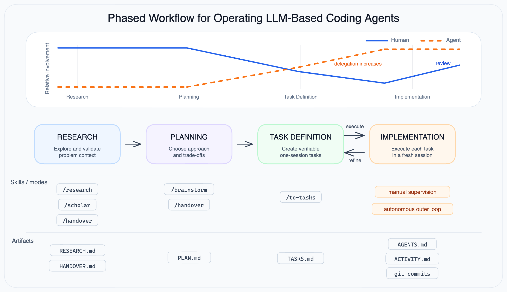

# Agentic Development Workflow

Companion repository for the paper "A Phased Workflow for Operating LLM-Based Coding Agents".

The workflow structures agent-assisted development into four phases:

```text
Research -> Planning -> Task Definition <-> Implementation
```

Human effort is front-loaded. Agent delegation increases as the artifacts become more precise. When implementation exposes a bad task definition, return to task definition instead of patching around the problem in code.



Figure source: [`figures/workflow.excalidraw`](figures/workflow.excalidraw)

## Workflow at a glance

| Phase | Human role | Agent role | Output | Skills |
| --- | --- | --- | --- | --- |
| Research | Guide scope, validate findings | Explore code, docs, papers, and constraints | `RESEARCH.md` | `/research`, `/scholar`, `/handover` |
| Planning | Decide approach, curate trade-offs | Propose options and stress-test decisions | `PLAN.md` | `/brainstorm`, `/handover` |
| Task Definition | Validate task boundaries and dependencies | Convert the plan into executable tasks | `TASKS.md` | `/to-tasks` |
| Implementation | Supervise, review, verify | Execute tasks in fresh sessions | `ACTIVITY.md`, commits | manual supervision or autonomous loop |

## Core idea

Upstream errors compound. Weak research produces weak plans. Weak plans produce vague tasks. Vague tasks produce brittle code. The workflow reduces this risk by keeping early phases human-heavy and by replacing long conversation history with curated files.

Persistent artifacts are part of the harness:

- `RESEARCH.md` captures validated findings.
- `PLAN.md` captures the selected approach and rejected alternatives when relevant.
- `TASKS.md` defines independent, verifiable tasks.
- `ACTIVITY.md` records implementation attempts and blockers.
- Git commits preserve working state between fresh sessions.

## Context management

Use four context strategies across all phases:

| Strategy | Use in this workflow |
| --- | --- |
| write | Persist findings, plans, tasks, logs, and commits outside the chat context. |
| select | Load only the files, tools, and docs needed for the current phase. |
| compress | Replace long discussions with curated artifacts such as `PLAN.md` or `HANDOVER.md`. |
| isolate | Start fresh sessions for task execution or for unrelated research branches. |

These strategies reduce common long-context failure modes: distraction, confusion, poisoning, and context clash.

## Phase guide

### 1. Research

Goal: understand the problem space before choosing a solution.

Recommended skills:

- `/research` for structured investigation across code, docs, literature, and user interviews.
- `/scholar` for academic paper search when relevant.
- `/handover` when the session gets too large or another agent needs to continue.

Practices:

- Keep the agent in read/search mode unless you explicitly start implementation.
- Withhold premature design opinions when you want broader exploration.
- Validate findings before promoting them into `RESEARCH.md`.

Output: `RESEARCH.md`.

### 2. Planning

Goal: decide the implementation approach.

Recommended skills:

- `/brainstorm` for decision-tree questioning and design convergence.
- `/handover` when planning context needs to be compressed.

Practices:

- Use the research artifact as input.
- Discuss alternatives until the approach is settled.
- Manually curate the result into `PLAN.md`; do not carry the full conversation forward.

Output: `PLAN.md`.

### 3. Task Definition

Goal: convert the plan into independent tasks that a fresh agent session can execute.

Recommended skill:

- `/to-tasks` to generate `TASKS.md` from `PLAN.md` and optional `RESEARCH.md`.

Practices:

- Keep each task small enough for one fresh session.
- Include file paths, dependencies, and verification steps.
- Avoid tasks that require hidden memory from prior sessions.

Output: `TASKS.md`.

### 4. Implementation

Goal: execute one task at a time with clean context.

Supported modes:

- Manual supervision: start one agent session per task, review the result, commit when satisfied.
- Autonomous outer loop: use `autonomous-implementation/` to run repeated fresh sessions with periodic human review.

Practices:

- Each session reads project instructions, `TASKS.md`, `ACTIVITY.md`, `PATTERNS.md`, code, and git history.
- Each session completes exactly one task, verifies it, logs the result, and stops.
- Human review remains required before merge.

Outputs: `ACTIVITY.md` updates and git commits on a feature branch.

## Repository layout

```text
agentic-development-workflow/
├── README.md
├── AGENTS.md
├── CLAUDE.md
├── figures/
│   └── workflow.excalidraw
├── skills/
│   ├── brainstorm/
│   ├── research/
│   ├── handover/
│   ├── scholar/
│   └── to-tasks/
├── autonomous-implementation/
│   ├── AGENTS.md
│   ├── CLAUDE.md
│   ├── PROMPT.md
│   ├── TASKS.md
│   ├── ACTIVITY.md
│   ├── PATTERNS.md
│   ├── SANDBOX.md
│   └── loop.sh
└── .claude/
    ├── settings.json
    ├── statusline-command.sh
    └── skills/ -> symlinks to ../skills
```

## Agent instructions

`AGENTS.md` is the canonical project instruction file. Adapters for specific tools should read and follow it instead of duplicating policy.

`CLAUDE.md` is a thin Claude Code adapter. `.claude/skills/` points to the canonical root `skills/` directory to avoid duplicated skill content.

## Autonomous implementation kit

`autonomous-implementation/` contains one optional implementation of the implementation phase. It is currently a Claude Code shell loop, so it is adapter-specific even though the workflow is agent-agnostic.

Use it only after research, planning, and task definition are complete:

```text
PLAN.md -> /to-tasks -> TASKS.md -> autonomous loop -> commits + ACTIVITY.md
```

Do not run the loop on `main`. Use a branch, a sandboxed environment, and human review before merge. See [`autonomous-implementation/SANDBOX.md`](autonomous-implementation/SANDBOX.md) for isolation options.

## Safety and privacy

Do not commit secrets, tokens, private endpoints, private model names, browser session data, or local machine settings. Keep local overrides in ignored files such as `.claude/settings.local.json`.

## License

Apache License 2.0. See [`LICENSE`](LICENSE).
